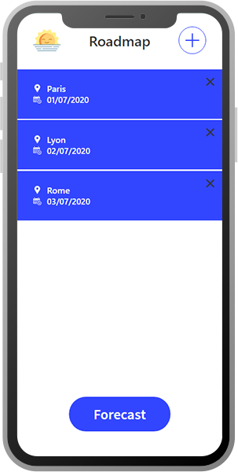
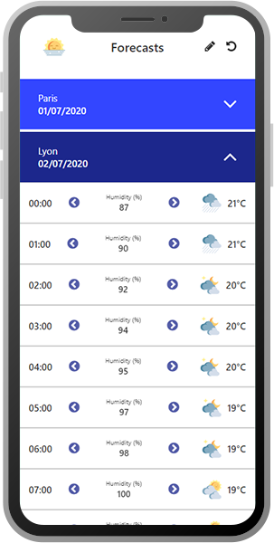

## 1. About

Tripeo is a React app providing you with weather data for your trips. 

You create a day by day roadmap of locations, and the app gives you weather forecasts. [Live Demo](https://tripeo.herokuapp.com/)

    

    

It leverages the [DarkSky Api](https://darksky.net/dev) for weather forecasts and [Algolia Places](https://community.algolia.com/places/) for input autocompletion (algolia-places-react hooks the api to React).

Tech Stack:
- React
- Redux
- redux-thunk
- styled-components
- Node (Express)
- PropTypes
- Jest
- Enzyme

## 2. Installation
- install server dependencies from root with `npm install`.
- install client dependencies from root with `npm client-install`.

- get your [DarkSky](https://darksky.net/dev) and [Algolia Places](https://community.algolia.com/places/) keys.

- create an `.env` file in root folder to add your `DARKSKY_API_KEY` key.
- create an `.env` file in client folder to add your `REACT_APP_ALGOLIA_APP_ID` and `REACT_APP_ALGOLIA_API_KEY` public keys.

## 3. Usage
- `npm run dev` or `yarn dev` to run the app on your local machine.
